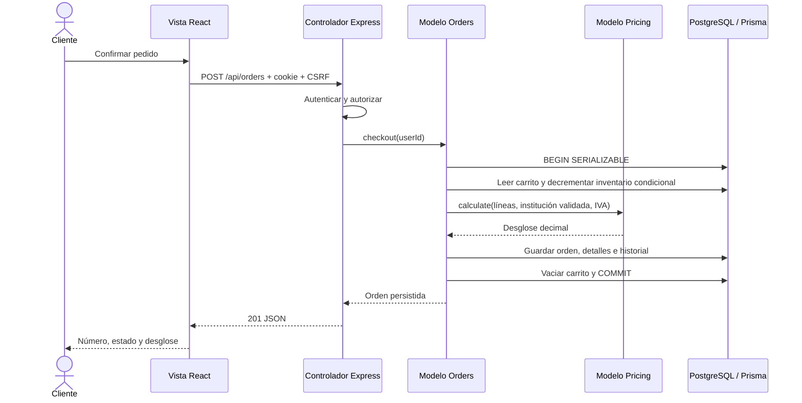
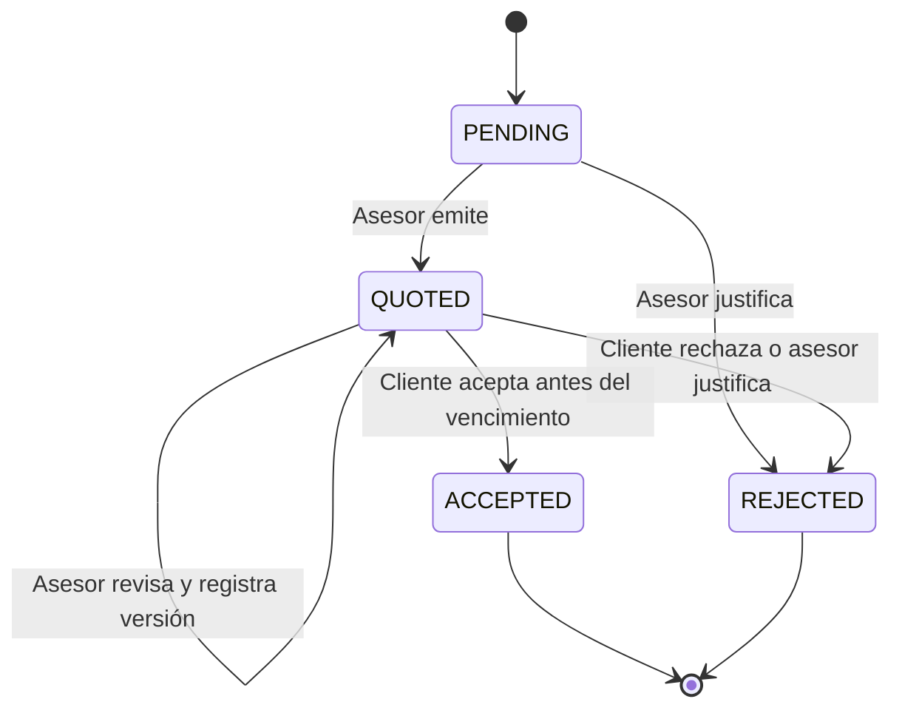
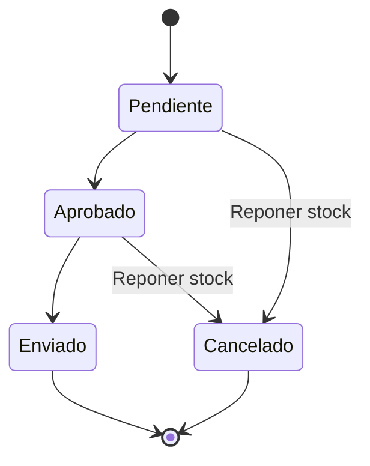

# MVC y secuencias

```mermaid
sequenceDiagram
  actor U as Cliente
  participant V as Vista React
  participant C as Controlador Express
  participant M as Modelo Orders
  participant P as Modelo Pricing
  participant DB as PostgreSQL / Prisma
  U->>V: Confirmar pedido
  V->>C: POST /api/orders + cookie + CSRF
  C->>C: Autenticar y autorizar
  C->>M: checkout(userId)
  M->>DB: BEGIN SERIALIZABLE
  M->>DB: Leer carrito y decrementar inventario condicional
  M->>P: calculate(líneas, institución validada, IVA)
  P-->>M: Desglose decimal
  M->>DB: Guardar orden, detalles e historial
  M->>DB: Vaciar carrito y COMMIT
  M-->>C: Orden persistida
  C-->>V: 201 JSON
  V-->>U: Número, estado y desglose
```

```mermaid
stateDiagram-v2
  [*] --> PENDING
  PENDING --> QUOTED: Asesor emite
  QUOTED --> QUOTED: Asesor revisa y registra versión
  PENDING --> REJECTED: Asesor justifica
  QUOTED --> REJECTED: Cliente rechaza o asesor justifica
  QUOTED --> ACCEPTED: Cliente acepta antes del vencimiento
  ACCEPTED --> [*]
  REJECTED --> [*]
```

```mermaid
stateDiagram-v2
  [*] --> Pendiente
  Pendiente --> Aprobado
  Pendiente --> Cancelado: Reponer stock
  Aprobado --> Enviado
  Aprobado --> Cancelado: Reponer stock
  Enviado --> [*]
  Cancelado --> [*]
```
